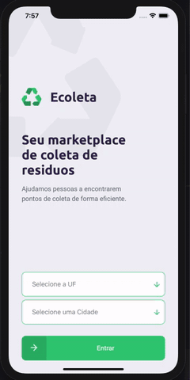

<h4 align="center">
<br>
 <b>Collect of organic and inorganic residue</b> ♻️🔋
</h4>

<p align="center">
  

  
  
  <a href="https://github.com/Rocketseat/semana-omnistack-9/commits/master">
    
  </a>

  <a href="https://github.com/Rocketseat/semana-omnistack-9/issues">
    
  </a>

  
</p>

<p >
  
  
</p>

### 💻 Project

<b>Ecoleta</b> It's a way to connect companies and organic and inorganic residue collect entities to the people that need to dispose of their residue in an environment friendly way.

## :rocket: Technologies

This project was developed with the following technologies:

- [Node.js](https://nodejs.org/en/)
- [Expo](https://expo.io/)
- [Express](https://expressjs.com/pt-br/)
- [React](https://pt-br.reactjs.org/)
- [React Native](https://reactnative.dev/)
- [TypeScript](https://www.typescriptlang.org/)

Extras:

- Main Libs
  - [Express](https://expressjs.com/pt-br/)
  - [KnexJS](http://knexjs.org/)
  - [SQLite3](https://www.sqlite.org/index.html)
  - [Axios](https://github.com/axios/axios)
  - [Leaflet](https://leafletjs.com/)
  - [Expo Google Fonts](https://github.com/expo/google-fonts)
  - [Picker Select](https://github.com/lawnstarter/react-native-picker-select)
  - [Multer](https://github.com/expressjs/multer)
  - [Celebrate](https://github.com/arb/celebrate)
  
- Styles
  - [EditorConfig](https://editorconfig.org/)
  - [ESLint](https://eslint.org/)
  - [Prettier](https://prettier.io/)


### Prerequisites

Before you begin, you need to have installed the following tools:

<b>[Git](https://git-scm.com)</b>

<b>[Node.js](https://nodejs.org/en/)</b>


### 🧭 Running the Backend

```bash
# Clone this repository
$ git clone https://github.com/mschneider86/ecoleta

# Access the project folder on terminal/prompt
$ cd ecoleta

# Go to backend folder
$ cd backend

# Install the dependencies
$ npm install ou yarn add

# Execute the application on dev mode
$ npm run dev ou yarn dev

# The server will start on port:3333 - access it on http://localhost:3333
```

### 🧭 Running the Frontend

```bash
# Clone this repository
$ git clone https://github.com/mschneider86/ecoleta

# Access the project folder on terminal/prompt
$ cd ecoleta

# Go to frontend folder
$ cd frontend

# Install the dependencies
$ npm install ou yarn add

# Execute the application
$ npm start ou yarn start

# The app will start on port:3000 - access it on http://localhost:3000
```

### 🧭 Running the Mobile

```bash
# Clone this repository
$ git clone https://github.com/mschneider86/ecoleta

# Access the project folder on terminal/prompt
$ cd ecoleta

# Go to Mobile folder 
$ cd mobile

# Install the dependencies
$ npm install ou yarn add

# Start the app
$ expo start

```

## 🤔 How to contribute

- Fork this repo;
- Create a branch with your feature: 'git checkout -b my-feature';
- Commit your changes: `git commit -m 'feat: My new feature'`;
- Push to your branch: 'git push origin my-feature'.
